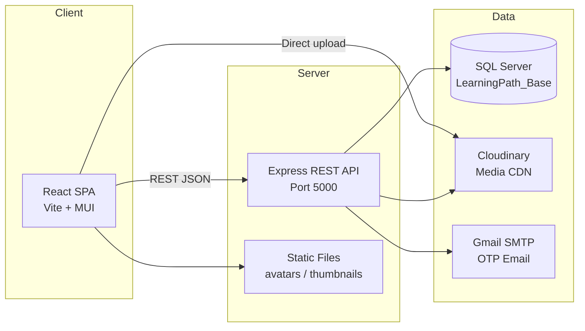

# S.T.A.R Learning Path

> Nền tảng học trực tuyến theo lộ trình cá nhân hóa — đồ án tốt nghiệp **SWP391** (FPT University)

[](https://react.dev/)
[](https://vitejs.dev/)
[](https://expressjs.com/)
[](https://www.microsoft.com/sql-server)
[](https://cloudinary.com/)

---

## Mục lục

- [Giới thiệu](#giới-thiệu)
- [Tính năng chính](#tính-năng-chính)
- [Tech stack](#tech-stack)
- [Kiến trúc hệ thống](#kiến-trúc-hệ-thống)
- [Cấu trúc thư mục](#cấu-trúc-thư-mục)
- [Cài đặt & chạy dự án](#cài-đặt--chạy-dự-án)
- [Tài khoản demo](#tài-khoản-demo)
- [API & tài liệu](#api--tài-liệu)
- [Cơ sở dữ liệu](#cơ-sở-dữ-liệu)
- [Điểm nổi bật kỹ thuật](#điểm-nổi-bật-kỹ-thuật)
- [Trạng thái triển khai](#trạng-thái-triển-khai)
- [Nhóm phát triển](#nhóm-phát-triển)
- [Screenshots](#screenshots)

---

## Giới thiệu

**S.T.A.R Learning Path** là nền tảng e-learning giúp học viên theo dõi lộ trình học có cấu trúc (khóa học → chương → bài học → học liệu), trong khi mentor xây dựng nội dung, ngân hàng câu hỏi và bài kiểm tra theo kỹ năng IELTS-style (Listening / Reading / Writing).

Hệ thống hỗ trợ **3 vai trò**: Student, Mentor, Admin — mỗi vai trò có giao diện và luồng nghiệp vụ riêng.

| Thông tin | Chi tiết |
|-----------|----------|
| **Loại dự án** | Đồ án môn SWP391 — Software Project |
| **Repository** | [Learning-Path-SWP391-](https://github.com/themanhvxhg123/Learning-Path-SWP391-) |
| **Frontend** | http://localhost:5173 |
| **Backend API** | http://localhost:5000 |
| **Ngôn ngữ giao diện** | Tiếng Việt |

---

## Tính năng chính

### Học viên (Student)

- Đăng ký / đăng nhập với xác thực **OTP qua email**
- Khảo sát onboarding: lĩnh vực quan tâm, trình độ, mục tiêu học tập
- Khám phá khóa học: tìm kiếm, lọc theo danh mục / cấp độ / trạng thái ghi danh
- Ghi danh khóa học, theo dõi tiến độ (% hoàn thành)
- Học theo lộ trình: xem học liệu (text, PDF, video, audio), đánh dấu hoàn thành bài
- **Learning streak** — chuỗi ngày học liên tiếp
- Bình luận & đánh giá sao khóa học (có điều kiện hoàn thành bài)
- Làm bài kiểm tra cuối chương / cuối khóa (Listening, Reading, Writing)
- Quản lý hồ sơ cá nhân, avatar, đổi mật khẩu

### Mentor

- Tạo / chỉnh sửa khóa học theo wizard nhiều bước (thông tin → nội dung → duyệt → xuất bản)
- **Content builder** phân cấp: Chương → Bài học → Học liệu
  - Loại học liệu: TEXT, DOC, VIDEO, AUDIO, READING_DOC
  - Upload media qua **Cloudinary**, lưu trực tiếp hoặc qua backend
- **Ngân hàng câu hỏi** theo khóa học / chương / kỹ năng
  - Trắc nghiệm nhiều lựa chọn, cờ `IsUseForTest`
- Thiết lập bài kiểm tra chương & toàn khóa (thời gian, điểm đạt, số câu random, điều kiện tiên quyết)
- Xem danh sách học viên và tiến độ theo khóa
- Phản hồi bình luận học viên

### Quản trị viên (Admin)

- Dashboard thống kê người dùng, khóa học, ghi danh
- Quản lý tài khoản: CRUD, gán role, khóa/mở tài khoản
- Quản lý **Categories** & **Levels** (danh mục, cấp độ khóa học)
- Quản lý khóa học toàn hệ thống
- CMS tin tức (giao diện admin — dữ liệu mock)

---

## Tech stack

| Layer | Công nghệ |
|-------|-----------|
| **Frontend** | React 18, Vite 5, React Router 7, Material UI 9, React Hook Form, Yup, Axios, Day.js |
| **Backend** | Node.js, Express 4, express-validator |
| **Database** | Microsoft SQL Server (`mssql` driver) |
| **Authentication** | JWT, bcryptjs, OTP email (Nodemailer) |
| **Media storage** | Cloudinary (upload, signed URL, text proxy) |
| **File upload** | Multer (avatar local), Cloudinary (học liệu) |
| **API testing** | Postman Collection (`backend/STAR_Backend_Postman_Collection.json`) |
| **Lint** | ESLint (frontend) |

---

## Kiến trúc hệ thống



**Mô hình backend:** `Routes → Controllers → Models/Services` (raw SQL qua `mssql`)

**Mô hình frontend:** Feature-based — `features/<domain>/{pages, components, services, utils}`

---

## Cấu trúc thư mục

```
Learning-Path-SWP391-/
├── README.md
├── API_ENDPOINTS.md              # Tài liệu 65+ API endpoints
├── backend/
│   ├── server.js                 # Entry point Express
│   ├── config/                   # DB, Cloudinary
│   ├── routes/                   # auth, users, courses, mentor, admin, question-bank...
│   ├── controllers/
│   ├── Models/                   # Data access layer (SQL)
│   ├── services/                 # Cloudinary, streak, question bank save...
│   ├── middlewares/              # Auth, upload, thumbnail
│   ├── scripts/                  # SQL migrations
│   ├── uploads/avatars/          # Avatar local storage
│   └── STAR_Backend_Postman_Collection.json
└── frontend/
    └── src/
        ├── features/
        │   ├── auth/             # Login, register, OTP, survey
        │   ├── courses/          # Catalog, detail, comments
        │   ├── learning/         # My courses, learning page, tests
        │   ├── mentor/           # Course builder, question bank, quiz setup
        │   ├── admin/            # Accounts, catalog, news
        │   ├── news/             # Tin tức học viên
        │   └── profile/
        ├── shared/               # Layout, routing, UI components, theme
        ├── context/              # AuthContext
        └── hooks/                # useAutoLogout
```

---

## Cài đặt & chạy dự án

### Yêu cầu

- **Node.js** 18+ (khuyến nghị 21+)
- **Microsoft SQL Server** với database `LearningPath_Base`
- Tài khoản **Cloudinary** (upload học liệu)
- (Tuỳ chọn) Gmail App Password cho gửi OTP

### 1. Clone repository

```bash
git clone https://github.com/themanhvxhg123/Learning-Path-SWP391-.git
cd Learning-Path-SWP391-
```

### 2. Backend

```bash
cd backend
npm install
```

Tạo file `backend/.env` từ mẫu:

```env
# Database
DB_SERVER=localhost
DB_PORT=1433
DB_NAME=LearningPath_Base
DB_USER=<your_user>
DB_PASSWORD=<your_password>

# Cloudinary
CLOUDINARY_CLOUD_NAME=<cloud_name>
CLOUDINARY_API_KEY=<api_key>
CLOUDINARY_API_SECRET=<api_secret>

# Tuỳ chọn
PORT=5000
JWT_SECRET=star_learning_secret
EMAIL_USER=<gmail@gmail.com>
EMAIL_PASS=<app_password>
```

Chạy server:

```bash
npm start
# → http://localhost:5000
# Health check: GET /api/ping
```

### 3. Frontend

```bash
cd frontend
npm install
```

Tạo file `frontend/.env`:

```env
VITE_API_URL=http://localhost:5000
VITE_CLOUDINARY_CLOUD_NAME=<cloud_name>
VITE_CLOUDINARY_UPLOAD_PRESET=<unsigned_preset>
```

Chạy dev server:

```bash
npm run dev
# → http://localhost:5173
```

Build production:

```bash
npm run build
npm run preview
```

### 4. Migration SQL (tuỳ chọn)

Chạy thủ công trong SSMS nếu cần:

- `backend/scripts/migrate-paths-is-active.sql`
- `backend/scripts/migrate-path-nodes-is-active.sql`

---

## Tài khoản demo

| Role | Email | Mật khẩu |
|------|-------|----------|
| Admin | `admin@star.com` | `123456` |

> Xem thêm ví dụ request trong `backend/STAR_Backend_Postman_Collection.json`

---

## API & tài liệu

| Tài liệu | Mô tả |
|----------|--------|
| [API_ENDPOINTS.md](./API_ENDPOINTS.md) | Danh sách đầy đủ API, auth headers, response format |
| Postman Collection | `backend/STAR_Backend_Postman_Collection.json` |

### Nhóm API chính

| Prefix | Mô tả |
|--------|--------|
| `/api/auth` | Đăng ký, OTP, login, quên mật khẩu |
| `/api/users` | Profile, avatar, đổi mật khẩu |
| `/api/courses` | Catalog, ghi danh, học tập, tiến độ, streak, bình luận |
| `/api/mentor` | CRUD khóa học, nội dung phân cấp, publish/draft |
| `/api/question-bank` | Ngân hàng câu hỏi theo chương / kỹ năng |
| `/api/materials` | Upload học liệu Cloudinary, proxy text content |
| `/api/admin` | Quản lý user, category, level, course |

**Xác thực:** JWT (`Authorization: Bearer <token>`) hoặc header `x-user-id`

---

## Cơ sở dữ liệu

Database: **`LearningPath_Base`** trên SQL Server

### Sơ đồ nghiệp vụ chính

```
Course
 └── Paths (chương)
      └── Path_Nodes (bài học)
           └── Node_Materials (TEXT | DOC | VIDEO | AUDIO | READING_DOC)

Question_Bank (1 bank / khóa học)
 └── Questions_Path (theo chương)
      └── Question_Sections (Listening / Reading / Writing)
           └── Questions → Question_Choices

Tests / Test_Config / Test_Attempts  ← schema có sẵn, đang tích hợp dần
```

### Bảng quan trọng

| Nhóm | Bảng |
|------|------|
| User & Auth | `Users`, `Roles`, `User_Roles`, `OTP_Verification` |
| Catalog | `Categories`, `Levels`, `Courses`, `User_Courses` |
| Content | `Paths`, `Path_Nodes`, `Node_Materials`, `User_Nodes` |
| Question Bank | `Question_Bank`, `Questions_Path`, `Question_Sections`, `Questions`, `Question_Choices` |
| Social | `Course_Comments` |
| Tests (planned) | `Tests`, `Test_Config`, `Test_Config_Section`, `Test_Attempts` |

---

## Điểm nổi bật kỹ thuật

### Content Builder (Mentor)

- Wizard tạo khóa học nhiều bước với **leave guard** (cảnh báo mất dữ liệu chưa lưu)
- CRUD phân cấp qua REST: paths → nodes → materials
- Theo dõi dirty state, lưu từng chương, toggle publish theo chương/bài
- Hydrate nội dung TEXT từ Cloudinary sau khi lưu

### Cloudinary Pipeline

- Upload backend: TEXT (HTML raw), DOC, READING_DOC, AUDIO
- Upload trực tiếp frontend: video/audio với progress bar
- Signed download URL, proxy `GET /api/materials/text-content` cho iframe preview
- Tối ưu delivery: `q_auto` transformation

### Question Bank

- CRUD đầy đủ qua API, lưu transactional (`questionBankSaveService`)
- Phân section theo kỹ năng (`Section_Type`: Listening / Reading / Writing)
- Stats API: đếm câu active theo chương / toàn khóa
- UI outline panel, preview trước khi lưu section

### Bài kiểm tra (Student)

- Luồng: intro → timed attempt → điều hướng theo kỹ năng → auto-submit hết giờ → chấm điểm → làm lại
- Random đề từ ngân hàng câu hỏi theo config mentor
- Điều kiện tiên quyết: phải đạt quiz chương trước mới được làm chương sau
- *(Đang lưu config & attempt qua localStorage — backend Tests API đang phát triển)*

### Learning Streak

- Tính từ ngày hoàn thành bài học liên tiếp (`User_Nodes.CompletedAt`)
- Algorithm consecutive days trong `streakService.js`

### Bảo mật & UX

- OTP đăng ký (3 phút) và reset mật khẩu (5 phút)
- Auto-logout sau 3 giờ không hoạt động
- Role-based routing với `ProtectedRoute`
- Toast notification, error boundary, crop avatar/thumbnail

---

## Trạng thái triển khai

| Module | Backend | Frontend | Ghi chú |
|--------|:-------:|:--------:|---------|
| Auth / OTP / Onboarding | ✅ | ✅ | Hoàn chỉnh |
| Catalog / Ghi danh | ✅ | ✅ | API thật |
| Học tập / Tiến độ / Streak | ✅ | ✅ | API thật |
| Bình luận khóa học | ✅ | ✅ | API thật |
| Mentor content builder | ✅ | ✅ | CRUD REST |
| Question bank | ✅ | ✅ | API thật |
| Cloudinary materials | ✅ | ✅ | Upload + preview |
| Quiz config (mentor) | ⏳ | ✅ | localStorage |
| Student tests | ⏳ | ✅ | localStorage + paper builder |
| Admin news CMS | ⏳ | ✅ | Mock data |
| Tests DB schema | ⏳ | — | Migration tạm disable |

---

## Nhóm phát triển

Đồ án SWP391 — FPT University

| MSSV | Thành viên |
|------|------------|
| HE180380 | Hoàng Quốc Hưng |
| HE194923 | Nguyễn Tấn Dũng |
| HE181327 | Nguyễn Thế Mạnh |
| HE190473 | Nguyễn Thị Hải Yến |
| HE176116 | Trịnh Công Phúc Nguyên |

---

## Screenshots

> *Thêm ảnh chụp màn hình vào thư mục `docs/screenshots/` để portfolio trực quan hơn.*

Gợi ý các màn hình nên chụp:

1. Trang chủ / Home
2. Danh sách khóa học
3. Trang học (learning path)
4. Mentor — Content Builder
5. Mentor — Question Bank
6. Student — Làm bài kiểm tra
7. Admin — Quản lý tài khoản

---

## License

Dự án học tập — SWP391. Chỉ sử dụng cho mục đích học tập và portfolio.
